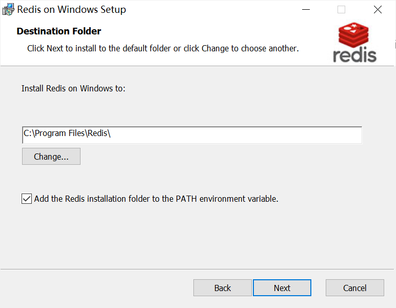

# regbrand
Scrawer  built by golang

### 下载Redis Server

```
https://github.com/tporadowski/redis/releases/download/v5.0.10/Redis-x64-5.0.10.msi
```

### Redis安装

注意添加到PATH，如下图打勾选中



修改配置 C:\Program Files\Redis\redis.windows.conf 设置密码

```
requirepass 123456
```

运行Redis Server

```
redis-server.exe redis.windows.conf
```


### 运行命令行

权明星如下

```
regbrand.exe -w qmx -p 1721 -c 25 -t 361
```

权大师如下

```
regbrand.exe -w qds -p 1721 -c 25 -t 361
```


